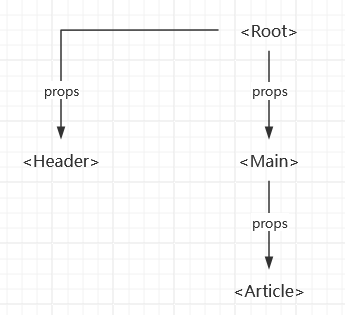
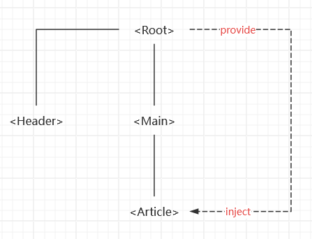

# {{ $frontmatter.title }}

一般的，我们需要从父组件向子组件传递数据时，会使用 props

但是，使用 props 在多层级组件中传递数据会十分麻烦，会出现下面 “逐级传递” 的情况



在上面的组件结构中，`Main` 组件其实是不关心 props 的内容的，只是为了需要把数据传递到 `Article` 组件，就需要在 `Main` 组件声明 props，这也显得十分没有必要

使用 `provide` 和 `inject` 可以解决这个问题



在上面的组件结构中，我们可以在父组件中通过 `provide` 提供需要的数据；在后代组件中通过 `inject` 注入其数据

## provide(提供)

使用 `provide` 函数为后代组件提供数据

```vue
<script setup>
import { provide } from 'vue'

/**
 * provide 函数接受两个参数
 * 1. 注入名
 * 2. 注入的值
 */
provide('key', 'value')
</script>
```

`provide` 函数的第二个参数可以传入任意类型的数据，包括响应式数据

如果提供的是响应式数据，那么后代组件中的数据也是响应式的

```js
import { provide } from 'vue'

const name = ref('gin')

// 后代组件在注入 name 时，该变量在父组件的变化也会响应式的传递到子组件
provide('name', name)
```

## inject(注入)

使用 `inject` 函数注入祖先组件提供的数据

```vue
<script setup>
import { inject } from 'vue'

/**
 * 注入祖先组件提供的数据
 * 1. 第一个参数为父组件提供的 key
 * 2. 第二个参数为默认值
 */
const name = inject('name', '这是默认值')
</script>

<template>
 <div>我的名字是：{{ name }}</div>
</template>
```

## 响应式数据的使用

尽量只在数据提供组件中修改响应式数据的状态

如果需要在后代组件中修改响应式数据的状态，应该在提供数据的组件声明一个修改该状态的方法

```vue
<!-- 数据提供组件 -->
<script setup>
import { ref, provide } from 'vue'

const name = ref('gin')

// 提供一个可以修改数据的方法
const modifyName = () => {
  name.value = 'amber'
}

provide('name', {
  name,
  modifyName
})
</script>
```

```vue
<!-- 数据注入组件 -->
<script setup>
import { inject } from 'vue'

// 直接结构提供的数据
const { name, modifyName } = inject('name')
</script>

<template>
  <div>我的名字：{{ name }}</div>
  <button @click="modifyName">更改名字</button>
</template>
```

## 参考链接

Vue 官方文档：[https://cn.vuejs.org/guide/components/provide-inject.html#provide-inject](https://cn.vuejs.org/guide/components/provide-inject.html#provide-inject)
