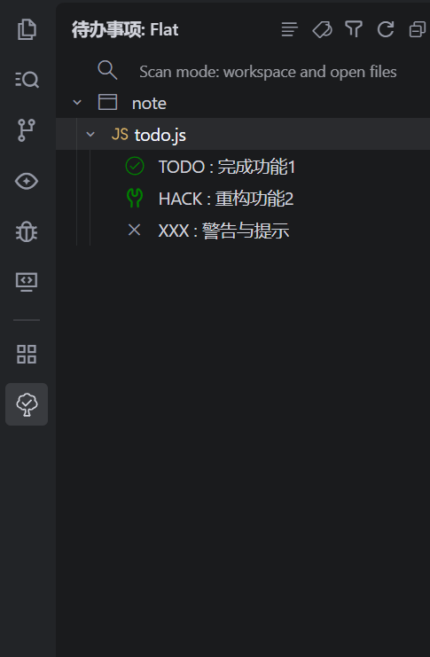
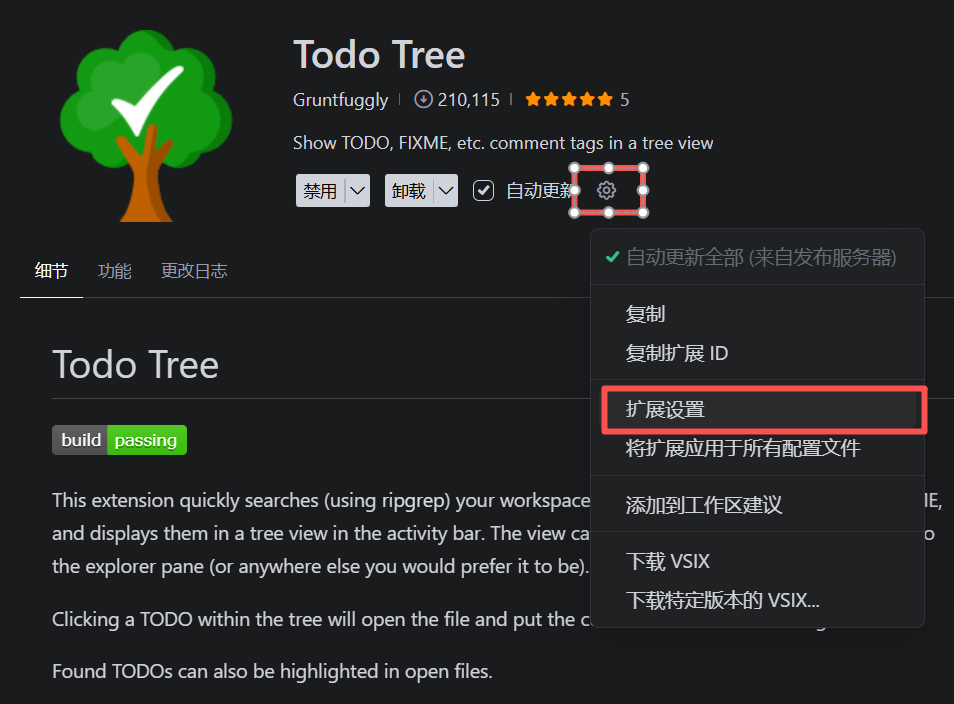
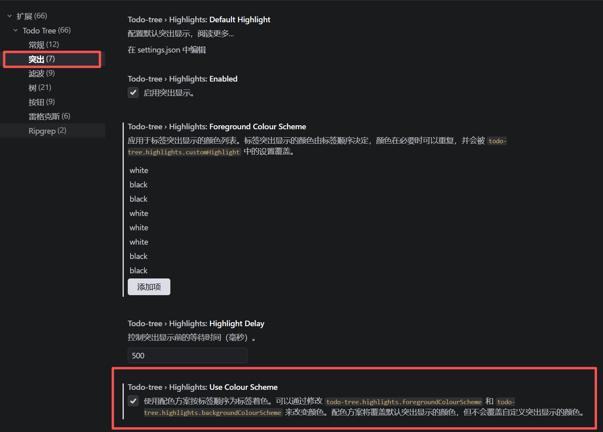
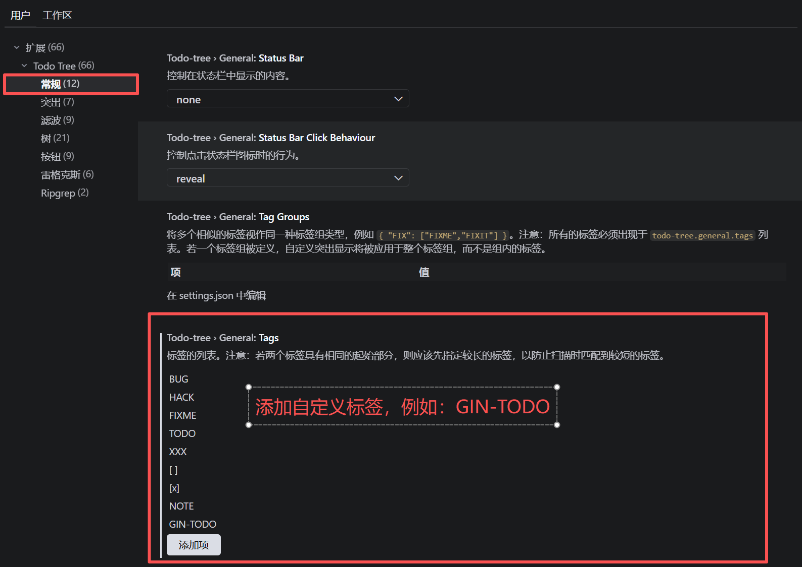
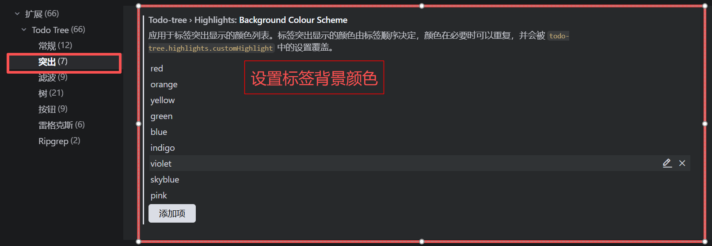
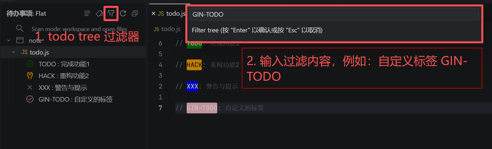
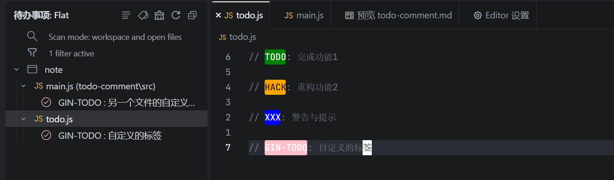

# Todo Comment

在开发中, 我们可以使用一些特殊的注释(TODO, FIXME...)来标记代码中的代办事项或待完善的任务, 便于开发过程中能够进行追踪和团队协作, 其写法如下:

```js
// 单行注释
// TODO: 代办描述

// 多行注释
/*
 * TODO: 代办描述
 * 其他描述
 */
```

## 常见标记

| 标记       | 说明                                       |
| ---------- | ------------------------------------------ |
| TODO       | 标记要完成或改进的功能                     |
| FIXME      | 标记需要修复的功能                         |
| NOTE       | 标记重要的解释, 帮助理解代码               |
| DEPRECATED | 标记即将废弃的代码                         |
| XXX        | 表示警告, 标记有问题或者需要特别注意的代码 |
| BUG        | 标记已知的 bug                             |
| HACK       | 标记临时解决方案, 后续可能重构的代码       |
| OPTIMIZE   | 标记可以优化的代码                         |

⚠️ 上面只是一些常见的标记, 在不同的团队或者项目中, 可能会使用自己的标记, 包括我们自己也可以使用自定义的标记

## Todo Tree 插件

Todo Tree 插件给编辑器提供了对 Todo 标记高亮, 查找, 过滤等操作

在安装了 Todo Tree 插件之后可以在编辑器的右侧看到一棵小树图标, 点击小树图标，我们可以看到该插件的工作区域



### 插件设置

在插件首页, 点击设置图标可以打开 Todo Tree 插件的设置页面



### 启用配色方案

勾选 `use colour scheme` 开启使用配色方案着色



启用配色方案后来的高亮效果


### 添加自定义标签

在 `常规` 设置下的 `Tags` 中可以添加自定义的标签, 例如, 下面我们添加 `GIN-TODO` 这样一个自定义标签



---

在 `突出` 设置下的 `background colour scheme` 可以为标签设置高亮的背景颜色

颜色的使用顺序是与标签对应的, 例如: `BUG` 是第一个标签, 则会渲染 `red`; `hack` 是第二个标签则会渲染 `orange`



---

配合 Todo Tree 的过滤功能可以很快的找到我们自定义的标签



过滤结果如下


