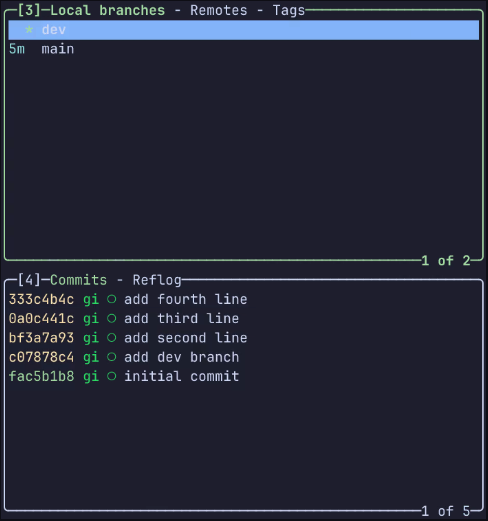

# cherry-pick

有时, 我们只想把一条分支上一个或多个 commit, 而不是整个分支上的所有 commit 都合并到另一条分支上; 例如: 在 `dev` 分支上有3个超前于 `main` 分支的 commit, 而我们只想把 `dev` 分支上最新的一个 commit, 合并到 `main` 分支上, 就可以使用 `cherry-pick` 命令

`git cherry-pick` 命令的使用很简单, 例如, 把 hash 为 `98a783651711` 的 commit 合并到 `main` 分支上:

```bash
git switch main # 保证检出的是想要 cherry-pick 的分支
git cherry-pick 98a7 # 将 hash 为 98a783651711 的 commit 合并到 main 分支上
```

在 `lazygit` 中, 只需要在对应的 commit 上按下 <kbd>shift + c</kbd> 以复制此条 commit, 然后在检出的分支的 `commit 面板` 上按下 <kbd>shift + v</kbd> 就可以完成 cherry-pick

可以在2个面板中查看 commit 信息, 一个是在 `branch 面板` 中, 在对应的分支上按下 <kbd>Enter</kbd> 即可查看该分支的所有 commit; 另一个是在 `commit 面板`

所以, <kbd>shift + c</kbd> 的操作可以在 `branch 面板` 或 `commit 面板` 上进行, 而 <kbd>shift + v</kbd> 的操作就只能在 `commit 面板` 上进行


下面演示一下在 `lazygit` 中如何在 **本地分支** 和 **远程分支** 进行 cherry-pick

## 本地分支 cherry-pick

<video controls>
    <source src="./assets/git-local-cherry-pick.webm" type="video/webm"></source>
</video>

1.可以看到在本地 `dev` 分支上有4超前于 `main` 分支的 commit

<details>
    <summary>点击展开查看详情👀</summary>
    <div>
        
    </div>
</details>

---

2.我们在 `dev` 分支上的 `commit 面板` 上的 `92208550ef5b` 的 commit 在按下 <kbd>shift + c</kbd>, 再切换到 `main` 分支, 在 `commit 面板` 上按下 <kbd>shift + v</kbd>

此时 `lazygit` 会提示是否 cherry-pick, <kbd>Enter</kbd> 回车确认即可把 `92208550ef5b` 的 commit 合并到 `main` 分支上

<details>
    <summary>点击展开查看详情👀</summary>
    <video controls>
        <source src="./assets/git-local-cherry-pick-step-two.webm" type="video/webm"></source>
    </video>
</details>

---

3.cherry-pick 多条也是一样操作, 只需要依次在每条 commit 上按下 <kbd>shift + c</kbd>, 最后一起 <kbd>shift + v</kbd> 就可以了

<details>
    <summary>点击展开查看详情👀</summary>
    <video controls>
        <source src="./assets/git-local-cherry-pick-step-three.webm" type="video/webm"></source>
    </video>
</details>

## 远程分支 cherry-pick

当两个仓库有一些共同的模块，例如：`repo1` 和 `repo2` 都有 `admin` 模块

当修改了 `repo1` 中的 `admin`，`repo2` 同时也需要这一部分的修改，我们不需要在 `repo2` 再写一次代码，只需要把 `repo1` 中关于 `admin` 的这次提交 cherry-pick 到 `repo2` 中

```tree
cherry-pick
|-- repo1
|   `-- file.txt
`-- repo2
    `-- file.txt`
```

下面使用以上的两个仓库 `repo1` 和 `repo2` 做演示，在 `repo1` 中修改了 `file.txt`，再把 `repo1` 作为 `repo2` 的远程仓库，在 `repo2` 中把 `repo1` 关于 `file.txt` 的修改 cherry-pick 到 `repo2` 中

<video controls>
    <source src="./assets/git-remote-cherry-pick.webm" type="video/webm"></source>
</video>

1.我们在 `repo1` 修改了 `file.txt` 并提交

<details>
    <summary>点击展开查看详情👀</summary>
    <video controls>
        <source src="./assets/git-remote-cherry-pick-step-one.webm" type="video/webm"></source>
    </video>
</details>

---

2.在 `repo2` 中将 `repo1` 添加为远程仓库

在 `branch 面板` 按下 <kbd>]</kbd> 切换到 `Remotes` tab下; 在 `Remotes` tab下按下 <kbd>n</kbd> 并填入 `remote name(远程仓库名)` 和 `remote url(远程仓库地址)`, 即可添加一个远程仓库; 再按下 <kbd>f</kbd> 以拉取远程仓库的所有信息

<details>
    <summary>点击展开查看详情👀</summary>
    <video controls>
        <source src="./assets/git-remote-cherry-pick-step-two.webm" type="video/webm"></source>
    </video>
</details>

---

3.我们在 `repo2` 本地仓库中选择 `repo1` 远程仓库的 `1087a3e4fc98` 这条 commit 进行 cherry-pick，如果合并过程中有冲突的话解决冲突即可

<details>
    <summary>点击展开查看详情👀</summary>
    <video controls>
        <source src="./assets/git-remote-cherry-pick-step-three.webm" type="video/webm"></source>
    </video>
</details>

## 更改与提交

从 cherry-pick 的功能可以看出, 最好还是对一个 commit 有一定的要求:

1. 一个 commit 最好只针对该任务进行修改, 而不要带入其他任务的修改, 这样在 cherry-pick 时, 就不会带入一些无用的修改

2. commit 信息同样是重要的, 这样便于找到对应的 commit 进行 cherry-pick, 也更便于版本的回滚, 这就可以参考 [Conventional Commits](https://www.conventionalcommits.org/en/v1.0.0/) 这个规范了
