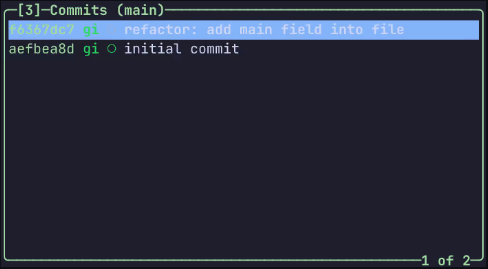
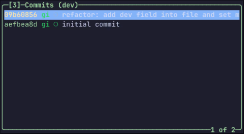
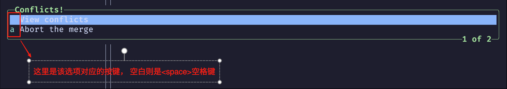
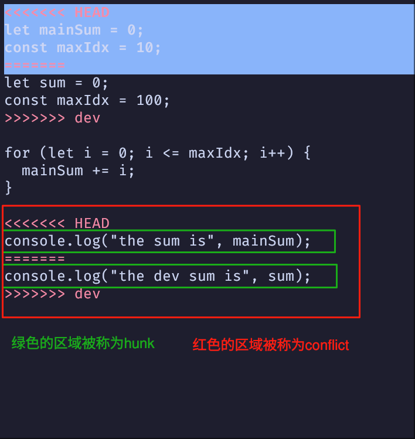
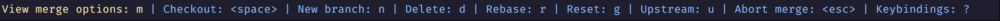

# 解决冲突

冲突的产生其实就是两位开发者在各自的分支上对同一文件同一个位置进行了修改, 在合并到同一条分支上的时候, git 无法知道应该使用哪一个修改, 这就是冲突的产生

产生的冲突可能好处理, 也可能不好处理; 对于好处理的冲突, 可以自行判断需要的代码, 从而解决冲突; 对于不好处理的冲突, 可能需要联系其开发者沟通解决

这篇笔记会详细的说一下在 `lazygit` 中如何解决冲突, 并都使用以下仓库做演示:

```tree
./conflict
├── file_one.js
└── file_two.js
```

## 直接在 lazygit 中解决冲突

对于一些简单的冲突, 可以直接在 `lazygit` 中的冲突面板解决

<video height="100%" autoplay controls>
    <source src="./assets/git-conflict-resolve.mp4" type="video/mp4"></source>
</video>

1.在这个仓库中, 我们在 `main` 和 `dev` 分支上对 file_one.js 和 file_two.js 都进行了修改

<details>
    <summary>点击展开查看详情👀</summary>
    <div>
        
        
    </div>
</details>

---

2.在我们要把 `dev` 分支合并到 `main` 分支上的时候, `lazygit` 就提示了冲突, 并询问我们是 `View conflicts(查看冲突)` 还是 `Abort the merge(中止合并)`; 视频中我们选择 `View conflicts(查看冲突)` 以查看冲突的文件

<details>
    <summary>点击展开查看详情👀</summary>
    <video height="100%" loop autoplay controls>
        <source src="./assets/git-conflict-resolve-step-two.mp4" type="video/mp4"></source>
    </video>
    <section>
        <div><strong>冲突选项按键说明</strong></div>
        
    </section>
    <section>
        <div><strong>冲突面板概念说明</strong></div>
        
    </section>
</details>

---

3.在产生了冲突的文件上, 按下 <kbd>Enter</kbd> 可以进入冲突面板, 视频中演示了冲突面板的大部分操作, 包括, 高亮上一个/下一个 hunk, 去到上一个/下一个 conflict, 选择 conflict 中的 1个 hunk 和 选择 conflict 中的2个 hunk 并撤销等操作

一个文件的冲突解决完后, 该文件从工作区面板消失, 当所有的冲突都解决后, `lazygit` 会提示是否继续合并, 按下 <kbd>Enter</kbd> 完成合并

**冲突面板案件说明**

| 按键             | 说明                          |
|----------------- | ----------------------------- |
| <kbd>Up</kbd>    | 高亮上一个 hunk               |
| <kbd>Down</kbd>  | 高亮下一个 hunk               |
| <kbd>Left</kbd>  | 去到上一个 conflict           |
| <kbd>Right</kbd> | 去到下一个 conflict           |
| <kbd>z</kbd>     | 撤销                          |
| <kbd>e</kbd>     | 编辑该文件                    |
| <kbd>Space</kbd> | 选择当前 conflict 高亮的 hunk |
| <kbd>b</kbd>     | 选择当前 conflict 的2个 hunk  |


<details>
    <summary>点击展开查看详情👀</summary>
    <video height="100%" loop autoplay controls>
        <source src="./assets/git-conflict-resolve-step-three.mp4" type="video/mp4"></source>
    </video>
</details>

## 在编辑器中解决冲突

对于复杂的冲突, 可以在编辑器中解决

例如, 把 file_two.js 中的冲突修改为下面的内容

```javascript
<<<<<<< HEAD
let mainSum = 0;                                        let mainSum = 0;
const maxIdx = 10;                                      const maxIdx = 100;
=======
let sum = 0;                              -->           for (let i = 0; i <= maxIdx; i++) {
const maxIdx = 100;                                       mainSum += i;
>>>>>>> dev                                             }

for (let i = 0; i <= maxIdx; i++) {                     console.log("the main sum is", mainSum);
  mainSum += i;
}

<<<<<<< HEAD
console.log("the sum is", mainSum);
=======
console.log("the dev sum is", sum);
>>>>>>> dev
```

可以看出, 要解决上面的冲突, 并不能简单的通过选择某一个 hunk 来解决, 所以, 在编辑器中解决冲突更加合适

在 `lazygit` 中只需要在冲突的文件上按下 <kbd>e</kbd> 就可以使用 git 设置的默认编辑器打开对应文件

<video height="100%" autoplay controls>
    <source src="./assets/git-conflict-resolve-editor.mp4" type="video/mp4"></source>
</video>

1.视频中, 我们在 file_two.js 上按下 <kbd>e</kbd>, `lazygit` 使用 `neovim` 打开了 file_two.js, 在解决完冲突保存后, 回到 `lazygit` 就会提示冲突解决完成, 按下 <kbd>Enter</kbd> 完成合并

**gui 编辑器**

如果使用的是非终端编辑器, 例如: vscode, sublime text等编辑器, 在这些编辑器中解决完冲突, `lazygit` 也会提示冲突解决完成, 询问是否继续合并

<video height="100%" autoplay controls>
    <source src="./assets/git-conflict-resolve-editor-vscode.mp4" type="video/mp4"></source>
</video>

遗憾的是, `lazygit` 暂时不支持使用 `trae`  编辑器打开文件; 不过可以在 `trae` 编辑器中找到对应的文件并解决冲突, `lazygit` 也会提示冲突解决完成

ps: 因为不知道如何在 Windows 下录制视频, 哈哈哈🤖, 所以这里就不放演示视频了, 但是实践过是可以的

## 取消合并

在解决冲突的过程中, 可能因为一些误操作导致某些已经处理的冲突不好恢复, 这时候是可以通过 `Abort the merge(中止合并)` 取消这次合并



上面是 `lazygit` 的底部按键提示栏, 这其中可以看到, `view merge options: m` 即 <kbd>m</kbd> 是可以打开合并选项的快捷键

<video height="100%" autoplay controls>
    <source src="./assets/git-conflict-resolve-abort-merge.mp4" type="video/mp4"></source>
</video>
