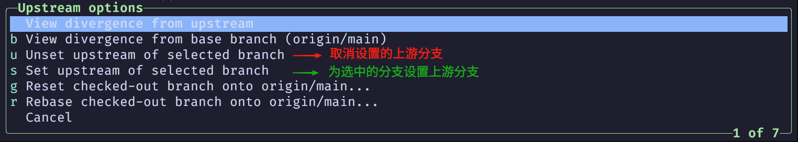

# 远程仓库

在我们使用 `git remote add origin <url>` 添加一个远程仓库后, 一般会使用 `git push origin main` 向名为 `origin` 的远程仓库推送本地 `main` 分支上的所有的内容

而后, 我们每次要向远程的 `origin` 仓库推送 本地 `main` 分支的内容都要使用 `git pull origin main` 命令

`git` 中提供了一个选项 `--set-upstream` 用于为本地分支设置一个远程的上游分支, 这使得我们之后推送内容时可以只使用 `git push` 命令进行推送

```bash
# 推送 main 分支的内容并设置远程仓库的上游分支
git push --set-upstream origin main

# 在此之后, 我们在 main 分支上推送内容时, 可以只使用 git push 命令
git push
```

在了解了上面的内容后, 我们来看看 `lazygit` 中远程仓库的操作

## lazygit 设置远程仓库的上游分支

在 `lazygit` 中, <kbd>Shift + p</kbd> 的推送操作其实使用的就是 `git push --set-upstream` 命令

`lazygit` 会在我们按下 <kbd>Shift + p</kbd> 后, 询问我们选择哪一条远程分支作为该本地分支的上游, 然后推送, 对应的 `git` 命令就是 `git push --set-upstream origin main`

而后, 我们再推送 `main` 分支的内容时, 只需要按下 <kbd>Shift + p</kbd>, `lazygit` 就会向我们设置好的上游推送, 对应的 `git` 命令就是 `git push`

<video height="100%" loop autoplay controls>
    <source src="./assets/git-remote-set-upstream-main.mp4" type="video/mp4"></source>
</video>

## lazygit 添加多个远程仓库

在 `lazygit` 的 `branch 面板` 的 `Remotes` 标签下, 按下 <kbd>n</kbd> 并在填入对应的 `remote name(远程仓库名)` 和 `remote url(远程仓库地址)` 后, <kbd>Enter</kbd> 就可以添加一个远程仓库

<video height="100%" loop autoplay controls>
    <source src="./assets/git-remote-add-remote-repo.mp4" type="video/mp4"></source>
</video>

## lazygit 多个远程仓库的推送

从上面提到的内容可以知道, 我们在使用 `lazygit` 推送一次代码后, `lazygit` 会为我们设置好上游分支

这会使得我们在后续的推送和拉取操作都默认在该上游分支进行, 如果存在多个远程仓库的情况下, 我们就不能指定推送和拉取的远程仓库了

在 `lazygit` 中, 提供了 <kbd>u</kbd> 按键, 让我们可以操作上游分支

在 `branch 面板` 按下 <kbd>u</kbd> 后, 会出现如下菜单, 可以暂时只关注 `Unset upstream of selected branch(取消设置上游分支)` 和 `Set upstream of selected branch(设置上游分支)` 两个选项



1. `Unset upstream of selected branch(取消设置上游分支)` 可以重置当前分支的上游分支

2. `Set upstream of selected branch(设置上游分支)` 可以为当前分支的设置上游分支

所以, 如果我们想向不同的远程仓库推送, 只需要在 `branch 面板` 按下 <kbd>u</kbd> 选择 `Set upstream of selected branch(设置上游分支)` 后, 选择对应的远程分支即可

<video height="100%" loop autoplay controls>
    <source src="./assets/git-remote-push-upstream.mp4" type="video/mp4"></source>
</video>

1.在视频中可以看到, 我们添加了两个远程仓库, 分别为 `origin` 和 `upstream`, 当我们第一次 <kbd>Shift + p</kbd> 的时候, `lazygit` 会提示我们为当前的 `main` 分支选择一个上游, 我们首先选择了 `origin main` 作为上游并推送

<details>
    <summary>点击展开查看详情👀</summary>
    <video height="100%" loop autoplay controls>
        <source src="./assets/git-remote-push-upstream-step-one.mp4" type="video/mp4"></source>
    </video>
</details>

---

2.接下来, 我们也想把本地 `main` 分支上的内容推送到远程的 `upstream main` 分支上, 这只需要在 `branch 面板` 按下 <kbd>u</kbd> 选择 `Set upstream of selected branch(设置上游分支)` 之后, 我们再选择 `upstream main` 作为上游, 最后推送即可

<details>
    <summary>点击展开查看详情👀</summary>
    <video height="100%" autoplay controls>
        <source src="./assets/git-remote-push-upstream-step-two.mp4" type="video/mp4"></source>
    </video>
</details>

## 在 lazygit 中运行 git 命令

在 `lazygit` 中, 是允许我们执行 `git` 命令的, 只需要按下 <kbd>:</kbd> 后输入 `git <命令>` 就可以执行对应的 `git` 命令了

例如, 我们要向 `upstream main` 这条远程分支推送内容, 在按下 <kbd>:</kbd> 后输入 `git push upstream main` 就可以推送了

<video height="100%" loop autoplay controls>
    <source src="./assets/git-remote-shell-push.mp4" type="video/mp4"></source>
</video>

## 对配置文件的影响

使用了 `--set-upstream` 选项后, `git` 其实会在该仓库的配置文件(`.git/config` )中添加一些内容

**git 仓库默认配置**

```ini
[core]
  repositoryformatversion = 0
  filemode = true
  bare = false
  logallrefupdates = true
[remote "origin"]
  url = git@gitee.com:gin18/git-study.git
  fetch = +refs/heads/*:refs/remotes/origin/*
```

**git 仓库 `--set-upstream` 后的配置**

```ini
[core]
  repositoryformatversion = 0
  filemode = true
  bare = false
  logallrefupdates = true
[remote "origin"]
  url = git@gitee.com:gin18/git-study.git
  fetch = +refs/heads/*:refs/remotes/origin/*
[branch "main"]
  remote = origin
  merge = refs/heads/main
```

在上面列出的配置中, 可以看出使用 `git push --set-upstream origin main` 后, `git` 在 `.git/config` 文件中添加的是以下的内容

这就是本地 `main` 分支对应的上游 `origin main`

```ini
[branch "main"]
  remote = origin
  merge = refs/heads/main
```
