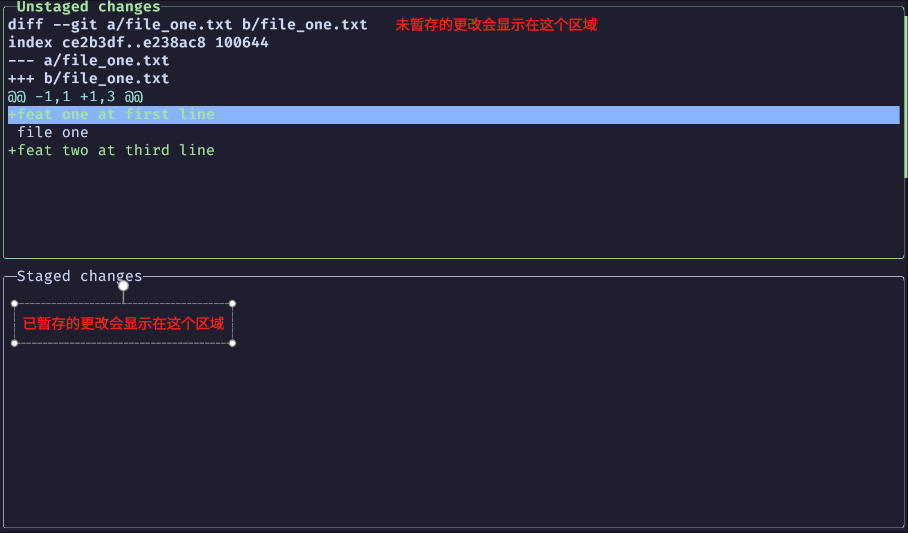

# git stage(暂存)

在 git 中, 有一个暂存区的概念, 在 git 所追踪的文件在被更改后, 这些更改的内容会处于 `unstage(未暂存)` 状态, 当我们使用 `git add <file_name>` 命令暂存一个文件的时候, 对于这个文件的更改就会被放入暂存区中, 只有在暂存区中的更改才能被 `commit(提交)`

下面会使用下面的仓库在 lazygit 中演示

```tree
./stage
├── file_one.txt
└── file_two.txt
```

## hunks

hunks 指的是代码差异的补丁块, 当我们对文件进行更改后, git 会将我们的更改转换成 hunks, 并通过 hunks 来记录和管理代码修改历史

简单理解就是 hunks 记录我们在一个文件中的什么位置做了什么更改, 例如: 更改了12行的某个单词, 新添加了16行等, 这些信息

在 git 中, 暂存操作其实都是针对于 hunks

## 暂存文件的所有 hunks

在工作区面板按下 <kbd>a</kbd> 键可以暂存所有文件的 hunks, 再次按下 <kbd>a</kbd> 键可以取消所有暂存

<video height="100%" autoplay controls>
    <source src="./assets/git-stage-all.mp4" type="video/mp4"></source>
</video>

如果我们只想暂存某些文件的 hunks, 只需要在对应的文件上按下 <kbd>Space</kbd> 键即可, 再次按下 <kbd>Space</kbd> 键可以取消暂存

<video height="100%" autoplay controls>
    <source src="./assets/git-stage-one.mp4" type="video/mp4"></source>
</video>

## 暂存文件的部分 hunks

有时, 我们可能在一个文件中做了多处更改, 而不同处的更改可能对应不同的 `feature(功能)` 或 `bug(缺陷)`

这时, 我们只想暂存某个 `feature(功能)` 的 hunks, 例如, `file_one.txt` 文件中的两处更改对应的就是 `feat one` 和 `feat two` 两个 `feature(功能)`

```diff
diff --git a/file_one.txt b/file_one.txt
index ce2b3df..e238ac8 100644
--- a/file_one.txt
+++ b/file_one.txt
@@ -1 +1,3 @@
+feat one at first line
 file one
+feat two at third line
--
```

现在, 我们需要对 `file_one.txt` 的两个 `feature(功能)` 分开暂存和提交

在 lazygit 中, 我们可以在对应的文件上按下 <kbd>Enter</kbd> 键就会进入 `stage面板`



`stage面板` 按键说明

| 按键             | 说明                                                                           |
| ---------------- | ------------------------------------------------------------------------------ |
| <kbd>Esc</kbd>   | 退出 `stage面板`                                                               |
| <kbd>Tab</kbd>   | 在 `unstage changes(未暂存更改)` 面板和 `stage changes(暂存更改)` 面板之间切换 |
| <kbd>Up</kbd>    | 高亮上一个 hunk                                                                |
| <kbd>Down</kbd>  | 高亮下一个 hunk                                                                |
| <kbd>Space</kbd> | 暂存/取消当前 hunk                                                             |

<video height="100%" autoplay controls>
    <source src="./assets/git-stage-hunk.mp4" type="video/mp4"></source>
</video>

## 放弃更改

有时, 我们会想要放弃对一个文件的更改, 例如: 正在开发的功能不再被需要, 我们就可以放弃关于这个功能的所有更改

<p style="color: red;">需要特别注意的是, 一旦放弃了文件的更改, 这些更改是不可找回的, 所以, 需要确认清楚再操作</p>

在 lazygit 中, 我们可以在对应的文件上按下 <kbd>d</kbd> 键, lazygit 会弹出选择框, 包括 `discard all changes(放弃所有更改)` 和 `discard unstaged hunk(放弃未暂存的 hunk)` 两个选项, 可以根据需要选择对应的选项

**放弃一个文件的所有更改**

<video height="100%" autoplay controls>
    <source src="./assets/git-stage-discard-file.mp4" type="video/mp4"></source>
</video>

**放弃一个文件的未暂存更改**

<video height="100%" autoplay controls>
    <source src="./assets/git-stage-discard-unstaged-file.mp4" type="video/mp4"></source>
</video>

我们也可以直接在 `stage面板` 中放弃对应的 hunk, 只需要在对应的 hunk上按下 <kbd>d</kbd> 键, lazygit 会询问我们是否放弃当前 hunk

<video height="100%" autoplay controls>
    <source src="./assets/git-stage-discard-hunk.mp4" type="video/mp4"></source>
</video>
