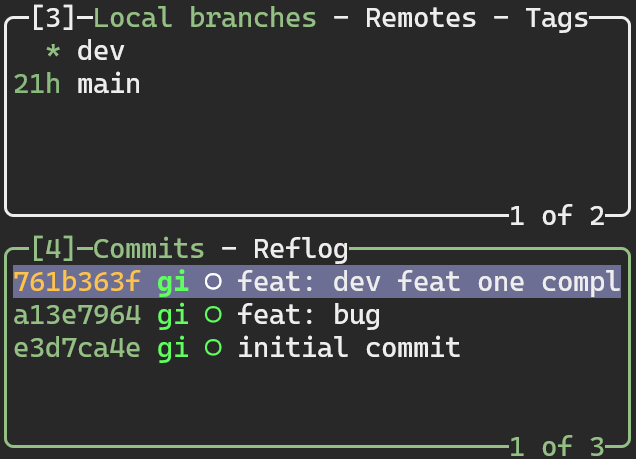

# git stash(贮藏)

有时, 当我们在一条分支上工作了一段时间, 但该任务又未完成; 这时, 我们想到另一条分支做一些其他的事, 例如: 修复一个紧急的 bug, 但是我们又不想为现在尚未完成的任务创建一次提交, 这时候可以使用 `git stash` 命令

`git stash` 命令会将未完成的修改保存在一个栈中, 我们可以在任何时候重新应用这些修改

下面就使用 `lazygit` 演示, 具体的命令可以查看 [Git-Tools-Stashing-and-Cleaning](https://git-scm.com/book/en/v2/Git-Tools-Stashing-and-Cleaning), 偷一下懒🥸

在我的仓库中有两条分支 `main` 和 `dev`, 并且 `dev` 上有一个超前于 `main` 分支的提交分支的提交

<video height="100%" autoplay controls>
    <source src="./assets/git-stash.mp4" type="video/mp4"></source>
</video>

1.可以看到在 `dev` 分支上一条超前于 `main` 分支的提交 -- `feat: dev working`

    
点击展开查看详情👀

    

---

2.我们在 `dev` 分支上做了一些修改 -- `console.log('dev working is not yet')`

    
点击展开查看详情👀

    <video height="100%" loop autoplay controls>
        <source src="./assets/git-stash-step-two.mp4" type="video/mp4"></source>
    </video>

---

3.这时, 我们在 `dev` 分支上的工作还没有完成, 又不想为这一次的未完成的工作创建一次提交, 就想要切换到 `main` 分支上修改 bug, 可以发现 lazygit 会提示 'Autostash', 但是不建议自动 stash, 所以我们选择手动 stash

    
点击展开查看详情👀

    
在第2个面板(工作区面板)上键入 <kbd>s</kbd>, 即可输入 stash 信息, 再按下 <kbd>Enter</kbd> 就可以发现 stash 信息被放在了左侧第5个面板(stash面板)显示, 在这个面板中可以操作 stash

    <video height="100%" loop autoplay controls>
        <source src="./assets/git-stash-step-three.mp4" type="video/mp4"></source>
    </video>

---

4.在 `dev` 上的工作 stash 后, 我们就可以切换到 `main` 分支上修改 bug

    
点击展开查看详情👀

    <video height="100%" loop autoplay controls>
        <source src="./assets/git-stash-step-four.mp4" type="video/mp4"></source>
    </video>

---

5.修改完 `main` 分支上的 bug 后, 我们又回到 `dev` 分支上, 可以在第5个面板(stash面板)上按下 <kbd>Space(空格)</kbd> 就可以重新应用需要的 stash

    
点击展开查看详情👀

    <video height="100%" loop autoplay controls>
        <source src="./assets/git-stash-step-five.mp4" type="video/mp4"></source>
    </video>

---

6.我们继续完成 `dev` 分支上的工作并提交

    
点击展开查看详情👀

    <video height="100%" loop autoplay controls>
        <source src="./assets/git-stash-step-six.mp4" type="video/mp4"></source>
    </video>

---

7.在将 `dev` 分支合并到 `main` 分支后, 就可以通过在 stash 面板上按下 <kbd>d</kbd> 并 <kbd>Enter</kbd> 将对应的 stash 删除

    
点击展开查看详情👀

    <video height="100%" loop autoplay controls>
        <source src="./assets/git-stash-step-seven.mp4" type="video/mp4"></source>
    </video>

