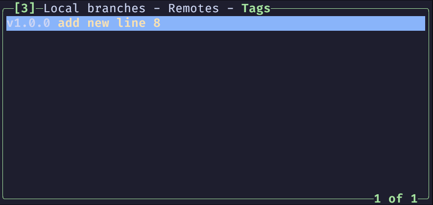

# git tag(标签)

tag 功能可以为某一次 commit 创建一个标签, 以表示这一次 commit 的重要性

tag 功能常用来标记发布节点, 也就是创建一个版本号(v1.0.0, v2.0.0)

具体的命令可以查看 [Git-Basics-Tagging](https://git-scm.com/book/en/v2/Git-Basics-Tagging), 偷一下懒🥸

这篇笔记就记录一下在 `lazygit` 中 tag 的相关操作

## lazygit 的 tags 面板

`lazygit` 的 `tags` 面板会列出当前仓库的所有的 tag, 我们可以在这个面板上对 tag 进行操作

## lazygit 创建 tag

在 `tags` 面板上, 按下 <kbd>n</kbd> 后, `lazygit` 会让我们输入 `tag name(标签名)` 和 `tag description(标签描述)`, 填入对应信息后, <kbd>Enter</kbd> 就可以创建一个 tag

<video height="100%" autoplay controls>
    <source src="./assets/git-tag-new.mp4" type="video/mp4"></source>
</video>

`lazygit` 默认会为最新的 commit 创建 tag, 如果需要为过去的 commit 创建 tag, 需要先将 git 的 `HEAD` 指向需要创建 tag 的 commit, 然后再按下 <kbd>n</kbd> 创建 tag

修改 `HEAD` 的指向, 只需要高亮对应的 commit 后, 再按下 <kbd>Space</kbd> 即可; 要恢复到最新的 commit, 只需要再在分支上按下 <kbd>Space</kbd> 即可

<video height="100%" autoplay controls>
    <source src="./assets/git-tag-switch-commit.mp4" type="video/mp4"></source>
</video>

下面演示一下为 `initial commit` 这条 commit 创建 tag

<video height="100%" autoplay controls>
    <source src="./assets/git-tag-initial-tag.mp4" type="video/mp4"></source>
</video>

## lazygit 推送 tag

tag 并不会随着 commit 的推送而被推送到远端仓库, 需要单独推送 tag

在 `tags` 面板上, 按下 <kbd>Shift + p</kbd> 就可以推送 tag

<video height="100%" autoplay controls>
    <source src="./assets/git-tag-push.mp4" type="video/mp4"></source>
</video>

## lazygit 删除 tag

在 `tags` 面板上, 按下 <kbd>d</kbd> 后在出现的选项菜单中选择对应的操作即可

<video height="100%" autoplay controls>
    <source src="./assets/git-tag-delete.mp4" type="video/mp4"></source>
</video>
