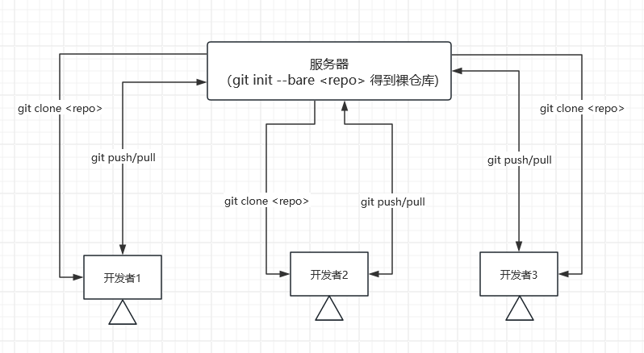

# {{ $frontmatter.title }}

## `.git` 目录

在一个 git 仓库中都会存在 `.git` 目录，用于存储所有的历史记录，元数据，分支信息，配置等

## 本地仓库和裸仓库

从类型上看，git 仓库可以分为 `本地仓库` 和 `裸仓库` 两种

* `本地仓库`：我们实际开发所在的仓库，包含了 `工作目录(working directory)` 和 `.git` 目录，`工作目录` 存放的是我们实际编辑的文件

* `裸仓库`：一般作为中央仓库使用，只用于记录 git 信息，其中只包含了 `.git` 目录，不存在 `工作目录`，所以，我们不能在其中执行 `git add`，`git commit` 此类操作

## 创建裸仓库

我们一般使用 `git init` 命令将当前目录初始化为一个 git 仓库，要创建裸仓库，只需要在此命令中加入 `--bare` 选项

裸仓库一般以 `.git` 结尾，例如：`my-project.git`

我们可以以下命令得到裸仓库：

```sh
# 初始化当前目录为裸仓库
# 例如：我们当前在 my-project.git 目录中，则可以使用下面的命令将 my-project.git 目录初始化为裸仓库
git init --bare


# 克隆已有仓库为裸仓库
git clone --bare <path/to/repo>

# 例如：将 my-project 仓库克隆为 my-project.git 裸仓库
git clone --bare <path/to/my-project> <path/to/my-project.git>
```

## 服务器上的裸仓库

在服务器上创建裸仓库，配合 SSH 服务，则可以将这个裸仓库视为一个中央仓库

开发者克隆该服务器的裸仓库到本地，开发并提交到此裸仓库中，过程大致如下：



例如：我们可以在自己的服务器(假设为47.83.45.72)上搭建中心仓库

```sh
# --- 服务端 ---
# 1. ssh 登录服务器
ssh root@47.83.45.72

# 2. 创建仓库目录
mkdir /root/git/my-project.git

# 3. 将 ~/git/my-project.git 初始化为裸仓库
cd /root/git/my-project.git && git init --bare

# --- 本地 ---
# 1. 克隆47.83.45.72服务器上的裸仓库
# 本地会得到 my-project 仓库，且该仓库的远程地址指向 root@47.83.45.72:/root/git/my-project.git
# 这一步其实就是通过 ssh 服务克隆了远程服务器的 git 仓库
git clone root@47.83.45.72:/root/git/my-project.git

# 2. 本地开发并推送至远程仓库
git add/commit/push
```
