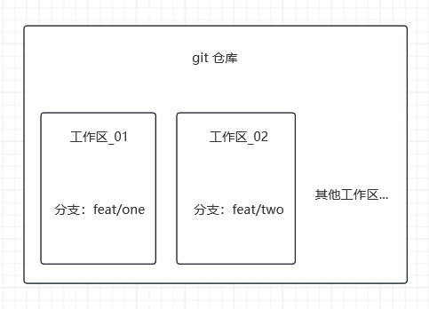
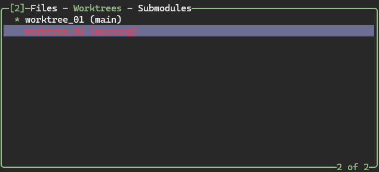
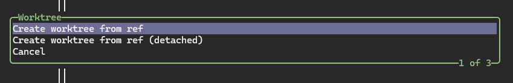
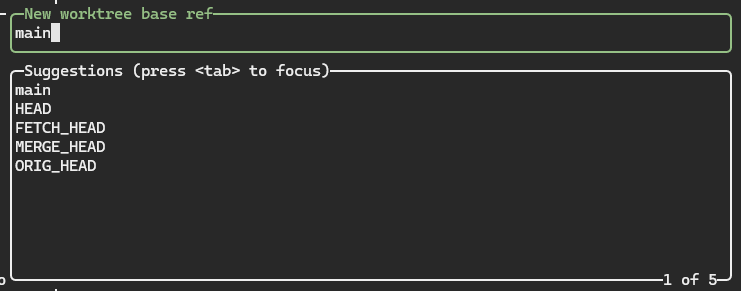
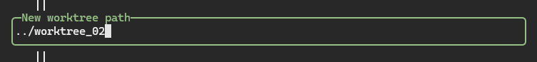
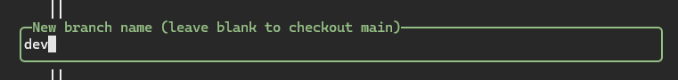
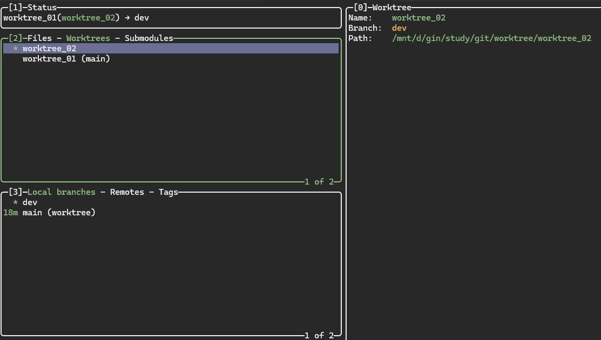

# {{ $frontmatter.title }}

在开发的过程中，我们可能会遇到这样的场景：

当我们在一条分支上工时，突然需要紧急处理一个 bug，或需要查看另一条分支的代码，我们一般可以按照下面的步骤操作：

1. 贮藏(`git stash`)当前分支上的修改

2. 切换到另一条分支，处理问题

3. 完成操作后，切换回原本的分支，并应用之前的贮藏

上面的操作可以满足我们的需求，但是在某些情况下仍存在一些问题：

1. 贮藏的内容多了，可能会忘记对应的分支上的贮藏

2. 同时查看多条分支上的内容

3. 多条分支的并行开发

`git worktree` 允许我们创建多个工作区，每个工作区单独检出一条分支，但享有同一个 `.git` 目录

这使得我们在切换工作区的时候，不受当前分支的影响，即使我们当前的分支未贮藏(`stash`)或提交(`commit`)，我们仍可以通过切换工作区，来切换分支



在 lazygit 中，我们可以在 `worktree` 面板中对工作区进行操作



下面的操作会使用以下结构的 git 仓库作为演示

```tree
.
`-- worktree_01
    |-- .git
    `-- worktree_01_file.txt
```

## 创建工作区

在 `worktree` 面板按下 n 键，lazygit 会询问我们以什么方式创建工作区，一般我们选 `create worktree from ref(从 ref 创建工作区)`



接着，lazygit 会让我们填写3个内容：

1. `New worktree base ref(新建工作区基于 ref)`：我们的工作区是基于哪一条分支创建的，我们可以在这里填写工作区的 base 分支

   

2. `New worktree path(新建工作区路径)`：git 会创建新的目录来存放我们的工作区，所以这里我们需要指定，这个目录的存放路径

   

3. `New branch name(新分支名)`：新的工作区需要单独检出一条分支，我们这里可以输入一条新的分支名称，以指定一条新的分支，或不输入以使用当前检出的分支作为该工作区的分支

   

在填写完对应的内容后，我们可以在 lazygit 中看到全部的工作区和他们各自检查的分支



我们再来看看现在 git 仓库的目录结构：

```tree
.
|-- worktree_01
|   |-- .git
|   `-- worktree_01_file.txt
`-- worktree_02
    |-- .git
    `-- worktree_01_file.txt`
```

在上面的结构中，我们可以看到 git 在我们指定的路径创建了 `worktree_02` 这个工作区

视频演示：

<video controls>
    <source src="./assets/lazygit-create-worktree.webm" type="video/webm"></source>
</video>

## 删除工作区

在对应的工作区按下 d 键，可以进行删除操作

删除工作区的同时，git 会将存放该工作区的目录一同删除，但是会保留该工作区的分支

<video controls>
    <source src="./assets/lazygit-remove-worktree.webm" type="video/webm"></source>
</video>

## 切换工作区

在对应的工作区上按下 space 键可以切换工作区，也可以通过切换工作区绑定的分支来切换工作区

即使我们在该工作区的更改未提交(`commit`)或未贮藏(`stash`)也是可以直接切换的

<video controls>
    <source src="./assets/lazygit-switch-worktree.webm" type="video/webm"></source>
</video>
