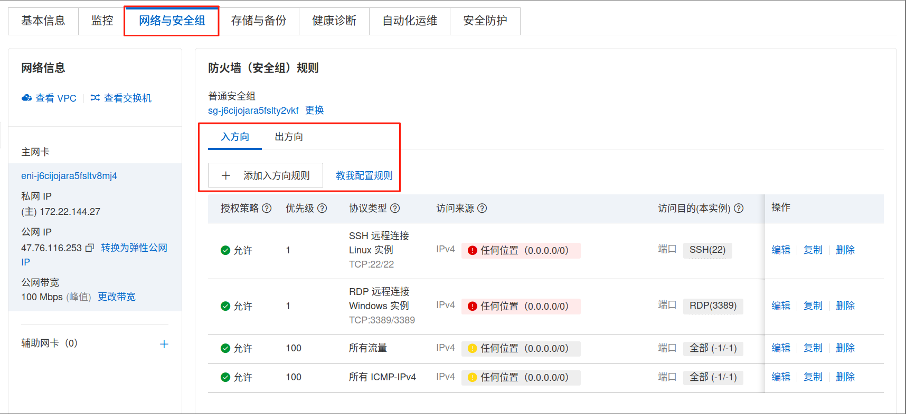
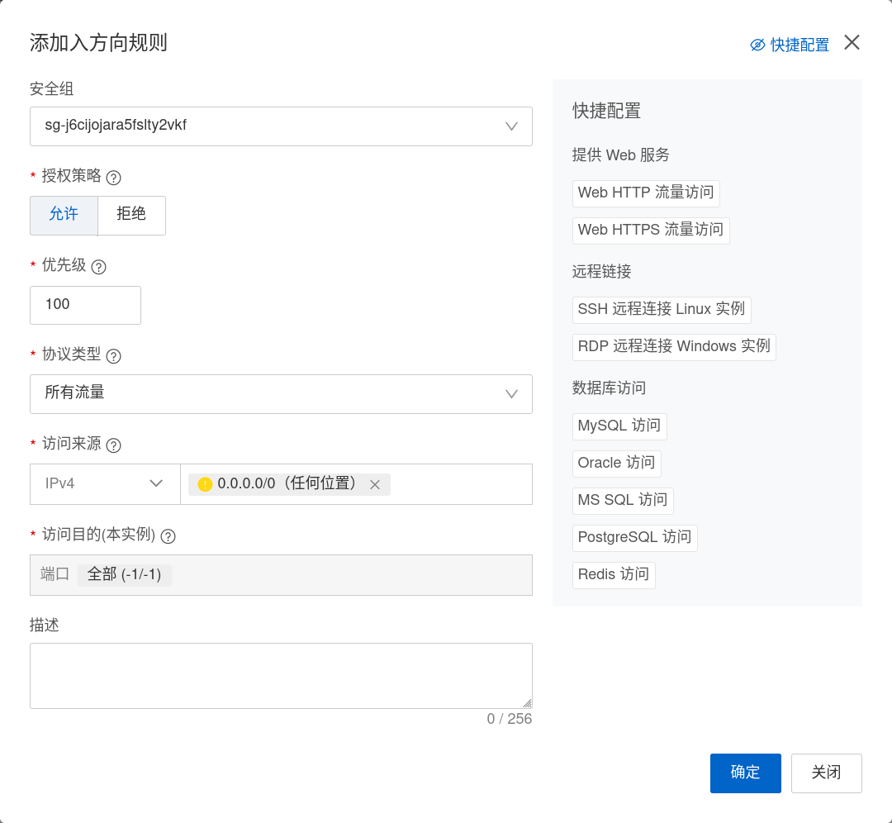
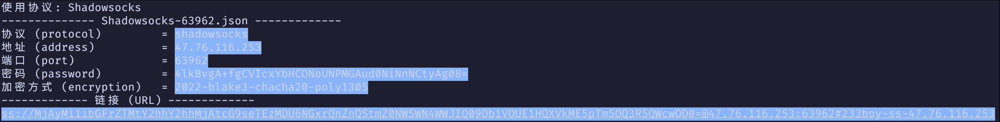
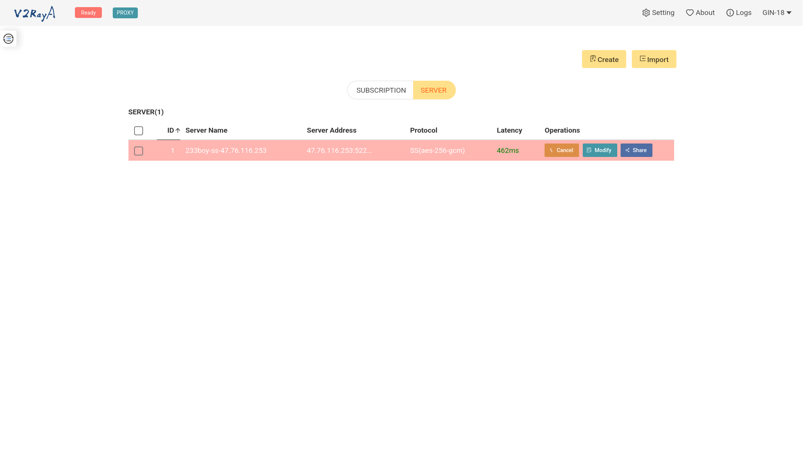
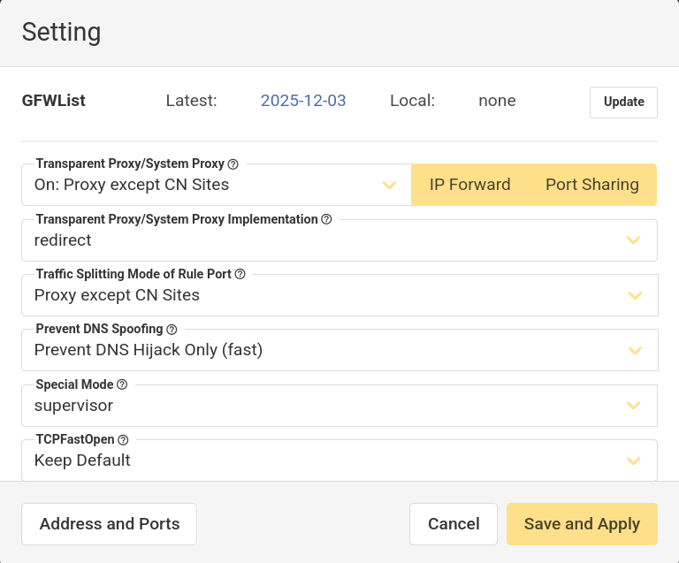
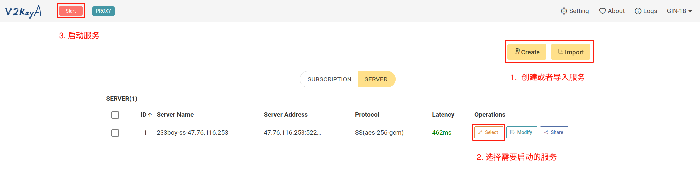

# v2ray

## 服务端

### sing-box 安装

Github: https://github.com/233boy/sing-box

教程: https://233boy.com/sing-box/sing-box-script/

#### 前置工作

* 准备一台境外服务器(中国香港地区亦可以)

* 确保服务器端口开放或者关闭防火墙

**端口配置**

不同云服务器厂商的服务器使用方式不同, 以阿里云为例:

在云服务器面板中的 `网络与安全组` 中设置防火墙的 `入方向` 和 `出方向`



可以根据自己的实际情况进行调整对应的规则



**关闭防火墙**

```bash
# 关闭firewalld防火墙
systemctl stop firewalld

# 关闭ufw防火墙
ufw disable
```

#### 安装

系统支持: `Ubuntu`, `Debian`; 推荐使用 `Ubuntu 22`

执行以下安装命令:

```bash
bash <(wget -qO- -o- https://github.com/233boy/sing-box/raw/main/install.sh)
```

安装过程未报错则安装成功

#### 测试连接

添加一个 `SS` 测试连接:

```bash
sb add ss
```

这会生成一个 `SS` 连接的配置, 使用客户端连接这个 `SS` 服务, 以验证是否连接成功



#### 管理面板

输入以下命令启动面板:

```bash
sb
```

进入面板界面可以进行管理操作

#### 无法使用

无法使用情况可以考虑检查:

* 端口是否开放, 或者防火墙是否关闭

* 客户端内核版本是否与服务端版本一致

## 客户端

### Windows客户端 - v2rayN

Github: https://github.com/2dust/v2rayN

下载地址: https://v2rayn.2dust.link/

#### 安装

在上面的下载地址中下载需要的安装包, 或使用 `winget`, `scoop` 等命令进行安装

#### 使用

因为我的 OS 是 Arch Linux, 所以这里先空着 :grimacing:

### Linux客户端 - v2rayA

Github: https://github.com/v2rayA/v2rayA

官方文档: https://v2raya.org/

其他文档: https://forum.archlinuxcn.org/t/topic/14853

#### 安装

在 `Arch Linux` 安装

```bash
sudo pacman -S v2raya
```

#### 使用

```bash
systemctl start v2raya
```

启动后, 可以在浏览器中输入 `localhost:2017` 进行访问



点击 `Setting` 进行配置, 推荐如下设置



导入 `Server`, 选择对应的 `Server` 进行连接



### MacOS客户端 - v2rayU

下载地址: https://sourceforge.net/projects/v2rayu.mirror/

我应该也不会用上苹果
