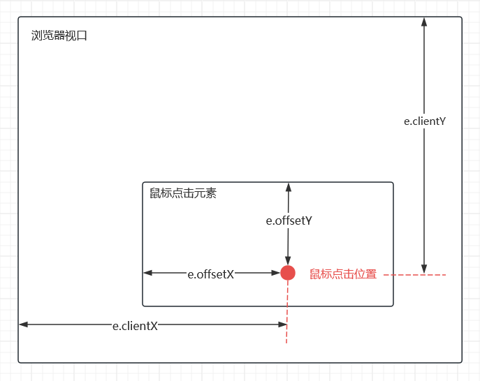
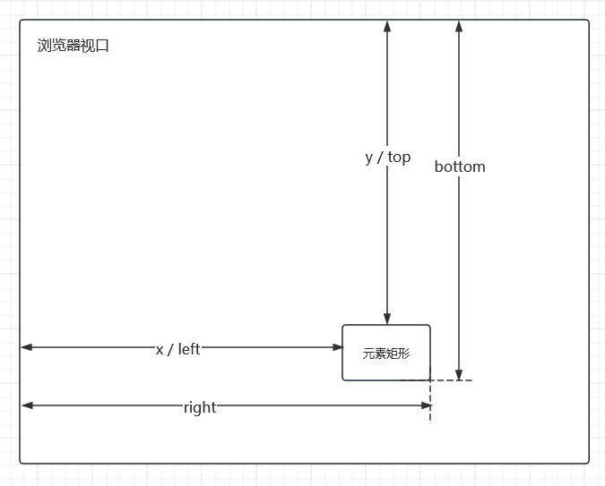

# 元素拖放

<script setup>
import ElementMovement from './components/ElementMovement.vue'
</script>

<ElementMovement />

## 浏览器视口(viewport)

viewport 指的是页面的可视区域

可以在页面中的以下代码中对 viewport 进行修改，其属性可以在 [MDN Viewport](https://developer.mozilla.org/zh-CN/docs/Web/HTML/Reference/Elements/meta/name/viewport) 查看

```html
<meta name="viewport" content="width=device-width, initial-scale=1" />
```

## e.clientX，e.clientY，e.offsetX，e.offsetY

* e.clientX：鼠标相对于视口的X坐标

* e.clientY：鼠标相对于视口的Y坐标

* e.offsetX：鼠标相对事件源元素的X坐标

* e.offsetY：鼠标相对事件源元素的Y坐标



## DOMRect

使用 `getBoundingClientRect()` 方法可以获得元素的 `DOMRect` 对象，这个对象包含了元素的最小矩形，使用 `left`，`top`，`right`，`bottom`，`x`，`y`，`width` 和 `height` 这些属性描述整个矩形的位置和大小

在 vue 中可以通过以下的方式获取 `DOMRect` 对象

```vue
<script setup>
const elRef = ref(null)

onMounted(() => {
  // elRect 就是 elRef 元素的 DOMRect 对象
  const elRect = elRef.value.getBoundingClientRect()
})
</script>

<template>
  <div ref="elRef"></div>
</template>
```



## 子元素在父元素中拖放

通过定位的方式设置子元素在父元素中的位置，只需要得到4个位置信息

* 子元素可移动的最大宽度，以限制子元素不能超出父元素宽度

* 子元素可移动的最大高度，以限制子元素不能超出父元素的高度

* 子元素左边缘距离父元素右边缘的距离，即子元素的左侧定位

* 子元素上边缘距离父元素上边缘的距离，即子元素的右侧定位

简单的代码实现

```vue

<script setup lang="ts">
import { ref, onBeforeUnmount, onMounted, nextTick } from 'vue'

const parentRef = ref<HTMLElement | null>(null)
const childRef = ref<HTMLElement | null>(null)

const x = ref(0)
const y = ref(0)

let dragging = false
let pointerId: number | null = null
let offsetX = 0
let offsetY = 0

function onPointerDown(e: PointerEvent) {
  if (!parentRef.value || !childRef.value) return
  // only left button or primary pointer
  if (e.button && e.button !== 0) return

  dragging = true
  pointerId = e.pointerId

  const parentRect = parentRef.value.getBoundingClientRect()
  const childRect = childRef.value.getBoundingClientRect()

  offsetX = e.clientX - childRect.left
  offsetY = e.clientY - childRect.top

  // set pointer capture so we continue to receive events
  try {
    childRef.value.setPointerCapture(pointerId)
  } catch {}

  window.addEventListener('pointermove', onPointerMove)
  window.addEventListener('pointerup', onPointerUp)
  window.addEventListener('pointercancel', onPointerUp)
}

function onPointerMove(e: PointerEvent) {
  if (!dragging || pointerId !== e.pointerId) return
  if (!parentRef.value || !childRef.value) return

  const parentRect = parentRef.value.getBoundingClientRect()
  const childRect = childRef.value.getBoundingClientRect()

  const relX = e.clientX - parentRect.left - offsetX
  const relY = e.clientY - parentRect.top - offsetY

  const maxX = parentRect.width - childRect.width
  const maxY = parentRect.height - childRect.height

  x.value = clamp(relX, 0, Math.max(0, maxX))
  y.value = clamp(relY, 0, Math.max(0, maxY))

  e.preventDefault()
}

function onPointerUp(e: PointerEvent) {
  if (!dragging) return
  dragging = false
  if (childRef.value && pointerId !== null) {
    try {
      childRef.value.releasePointerCapture(pointerId)
    } catch {}
  }
  pointerId = null
  window.removeEventListener('pointermove', onPointerMove)
  window.removeEventListener('pointerup', onPointerUp)
  window.removeEventListener('pointercancel', onPointerUp)
}

function clamp(v: number, a: number, b: number) {
  return Math.min(Math.max(v, a), b)
}

onMounted(() => {
  // wait for DOM to be painted so sizes are correct
  nextTick().then(() => centerChild())
})

onBeforeUnmount(() => {
  window.removeEventListener('pointermove', onPointerMove)
  window.removeEventListener('pointerup', onPointerUp)
  window.removeEventListener('pointercancel', onPointerUp)
})
</script>

<template>
  <div ref="parentRef" class="parent">
    <div ref="childRef" class="child" :style="{ left: x + 'px', top: y + 'px' }" @pointerdown="onPointerDown">
      drag me
    </div>
  </div>
</template>

<style scoped>
.parent {
  position: relative;
  width: 100%;
  height: 200px;
  border-radius: 4px;
  background: #eba0ac;
  overflow: hidden;
}

.child {
  position: absolute;
  left: 0;
  top: 0;
  padding: 2px 4px;
  border-radius: 4px;
  color: #eff1f5;
  background: #1e66f5;
  cursor: grab;
  user-select: none;
  touch-action: none;
}

.child:active {
  cursor: grabbing;
}
</style>
```
