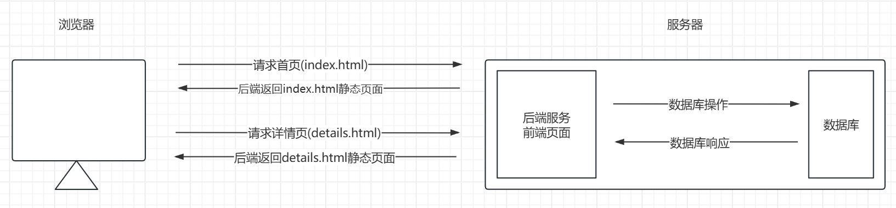
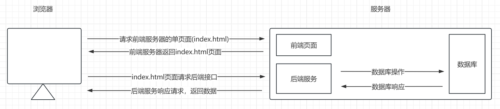

# 聊聊前后端分离

## 前后端不分离的开发模式

在前后端不分离的开发模式中，一般由前端工程师完成静态页面，再将这些静态页面交给后端工程师，后端工程师套用模板将页面数据嵌入静态页面中，用户在请求页面时，服务器则直接返回组装好的静态页面，其架构简单概括如下图：



在这个时期， 前后端的开发高度耦合，前端开发更多依赖后端开发，这是因为前端页面也是打包在后端服务中的，页面的渲染和项目的部署都依赖后端服务，前端工程师在开发周期中只是实现静态页面。

随着 Web 技术的发展，前端页面日益复杂，前后端不分离这种高耦合的开发模式，沟通成本高，开发效率低，难以应付复杂的开发需求，所以，就需要将前端的开发工作解耦出来，前端项目也应该需要 `工程化`，`模块化`。

## AJAX 技术的出现

Ajax 是一种在无需刷新整个页面的情况下，与服务器进行异步数据交互的技术，这能让页面实现局部刷新。

Ajax 准确的说是一种思想，其中包含了许多的技术，其技术实现有 XMLHttpRequest(XHR) 对象和 Fetch API，在前端中，我们就可以通过 XMLHttpRequest 对象或 Fetch API 发送 Http 请求。

在现在的 Vue 项目中常用的请求库 `axios` 就是 XMLHttpRequest(XHR) 对象的封装。

**XHR 发送请求**

使用 `XHR` 发送简单的 `GET` 请求。

```javascript
// Step 1: 实例化 xhr 对象
var xhr = new XMLHttpRequest();
// Step 2: 设置请求方式，请求地址，是否为异步请求 (method, URL, async)
xhr.open('GET', 'https://api.example.com/data', true);
// Step 3: 发送请求
xhr.send();
// Step 4: 监听请求结果
xhr.onload = function() {
    if (xhr.status >= 200 && xhr.status < 300) {
        console.log('Success:', xhr.responseText);
    } else {
        console.error('Request failed');
    }
};
```

**Fetch 发送请求**

使用 `fetch` 发送简单的 `GET` 请求。

```javascript
const result = fetch('https://api.example.com/data', {
    method: 'GET',
    headers: {
        'Content-Type': 'application/json'
    }
})
```

**axios 发送请求**

使用 `axios` 发送简单的 `GET` 请求。

```javascript
import axios from 'axios';

const result = axios.get('https://api.example.com/data', {
    params: {
        name: 'gin',
    },
    headers: {
        'Content-Type': 'application/json'
    }
})
```

虽然 Ajax 技术的出现可以让前端页面通过请求的方式与后端服务进行交互，但只要前端页面未能从后端项目中解耦出来，就还不能算是前后端分离的模式。

## 前后端分离的开发模式

在上面的内容可以知道，由于前后端不分离的开发模式，难以应对复杂项目的开发，就需要把前端的开发工作解耦出来，所以，前后端分离其实并不是一个技术问题，而是一个 `工程化考量` 和 `项目管理` 的问题，至于后来的 `Vue.js` 或 `React` 才是具体的技术实现。

真正的前后端分离应该体现在开发过程的每个环节，包括 `设计`，`开发`，`测试`，`部署`

* `设计阶段`：一般包括页面的设计，前端项目的架构设计，接口的设计

  页面的设计一般就是原型图，前端根据原型图实现页面；

  前端项目的架构设计一般是各种插件的的配置(eslint，prettier)，构建工具(webpack，vite)的配置，项目组件的封装；

  接口设计，在前后分离的开发模式中，前后端项目通过接口的方式进行交互，接口文档在设计阶段就可以设计好，以方便前后端根据接口文档独立开发；

* `开发阶段`：前端根据设计好的原型图开发页面，根据接口文档规定好的字段，请求方式发送请求，由于此时后端接口可能还没完成，不过前端需要的数据可以从 `Mock服务器` 获取，这样前端开发就不需要依赖实时的后端接口

* `测试阶段`：前端的测试主要就包括 `页面的交互`，`接口传参`，`数据展示` 等功能是否正常

* `部署阶段`：需要保证前后端项目可独立部署，前后端分离后，前端项目可独立打包并部署到 web 服务器上，常用的 web 服务器有 nginx

前后端分离架构简单概括如下图：


