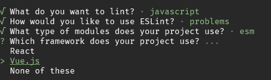
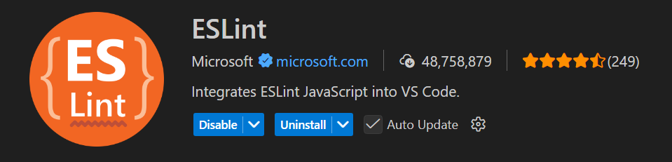
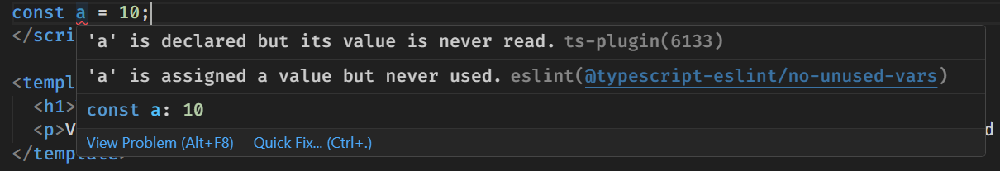

# {{ $frontmatter.title }}

ESLint 是一个代码检查工具，可以识别并报告代码问题，提高代码风格的一致性，避免错误

ESLint 会根据配置文件中的规则，对代码进行检查，例如：`"no-unused-vars": "error"` 规则表示代码中有未使用的变量则会报错

## 安装 ESLint

```sh
pnpm add --save-dev eslint@latest
```

## ESLint 配置

在 ESLint 9 版本之前可以看一些配置文件是 `.eslintrc.js`，`.eslintrc.yaml`

但是，在 ESLint 9 版本之后使用的是 `eslint.config.js` 这个配置文件，并且将其放在项目的根目录中

下面是一个简单的 ESLint 配置：

```js
// eslint.config.js
import { defineConfig } from "eslint/config";

export default defineConfig([
  {
    rules: {
      semi: "error",
      "prefer-const": "error",
    },
  },
]);
```

ESLint 9 之后采用扁平化配置的方式，向 `defineConfig()` 方法传递一个数组，数组的每个元素是一个配置对象

可以在这个数组中配置多个对象以实现针对性的配置，例如：可以通过 `files` 字段针对不同的文件进行不同的配置

具体的配置项字段可以在此链接查看：[configuration-objects](https://eslint.org/docs/latest/use/configure/configuration-files#configuration-objects)

```js
import { defineConfig } from "eslint/config";

export default defineConfig([
  {
    files: ["*.js"],
    rules: {
      semi: "error",
    },
  },
  {
    files: ["*.vue"],
    rules: {
      semi: "warn",
    },
  },
]);
```

## rules 字段配置项

`rules` 字段下的配置就是代码约束规则的具体配置，其配置项可以在此链接查看 [eslint rules](https://eslint.org/docs/latest/rules/)

`rules` 字段下的每个配置项可以设置以下的 3 类严重程度：

* `off / 0`：设置为 `off` 或者 `0` 表示不启用该配置项

* `warn / 1`：设置为 `warn` 或者 `1` 表示违反该配置项时给出警告

* `error / 2`：设置为 `error` 或者 `2` 表示违反该配置项时报错

如果一个配置项需要 设置多个值，则以数组的形式设置：

```js
import { defineConfig } from "eslint/config";

export default defineConfig([
  {
    files: ["*.js"],
    rules: {
      semi: "error",
      // 符合 unix 系统的换行符，违反则报错
      'linebreak-style': ['error', 'unix'],
    },
  }
]);
```

## 生成配置文件

ESLint 官方提供了生成默认配置文件的方式，使用以下命令，ESLint 会打开一个交互式的设置选择，我们可以选择需要的配置项

```sh
pnpm create @eslint/config@latest
```



在一个 Vue 项目中，选择以下基本的默认配置即可：

* `What do you want to lint?(检查什么文件)` -> 只选 `Javascript`

* `How would you like to use ESLint?(将如何使用ESLint)` -> 选 `To check syntax and find problems(检查语法并发现问题)`

* `What type of modules does your project use?(使用什么类型的模块化)`  -> 选 `JavaScript modules (import/export)`

* `Which framework does your project use?(使用的是什么框架)` -> 选 `Vue.js`

* `Does your project use TypeScript?(项目中是否使用了TS)` -> 选 `Yes`

* `Where does your code run?(代码在什么环境运行)` -> 选 `Browser` 和 `Node`

* `Which language do you want your configuration file be written in?(使用什么类型的配置文件格式)` -> 选 `Javascript`

* `Would you like to install them now?(是否安装对应的依赖)` -> 选 `Yes`

选择完以上的选项，会生成以下的配置：

```js
// eslint.config.js
import js from '@eslint/js';
import globals from 'globals';
import tseslint from 'typescript-eslint';
import pluginVue from 'eslint-plugin-vue';
import { defineConfig } from 'eslint/config';

export default defineConfig([
  {
    files: ['**/*.{js,mjs,cjs,ts,mts,cts,vue}'],
    plugins: { js },
    extends: ['js/recommended'],
    languageOptions: { globals: { ...globals.browser, ...globals.node } },
  },
  tseslint.configs.recommended,
  pluginVue.configs['flat/essential'],
  { files: ['**/*.vue'], languageOptions: { parserOptions: { parser: tseslint.parser } } },
]);
```

## 与 prettier 规则的冲突

在同时使用 ESLint 和 prettier 的时候，两者的某些配置项是重叠的，如果，ESLint 和 prettier 对同一项的配置不同，会导致该项配置有冲突

例如：ESLint 和 prettier 对 `semi` 的配置不同

```js
// .prettierrc.js
export default {
  semi: false, // 不要尾部的分号
};

// eslint.config.js
export default defineConfig([
  {
    files: ["*.js"],
    rules: {
      semi: ["error", "always"], // 总是需要尾部的分号，违犯报错
    },
  }
]);
```

以上的配置会在使用 prettier 格式化代码的时候，去掉尾部的分号，这样会导致 ESLint 的规则报错，所以，两者的某些配置是有冲突的

所以，为了避免这些冲突，我们可以将代码检查的工作交给 ESLint，而代码格式化的工作交给 prettier

可以安装以下两个依赖在 ESLint 中配置 prettier

* `eslint-config-prettier`：关闭 ESLint 中与 prettier 冲突的规则

* `eslint-plugin-prettier`：将 prettier 作为 ESLint 规则执行

```sh
pnpm add --save-dev eslint-plugin-prettier eslint-config-prettier
```

在 `eslint.config.js` 文件中添加这两个依赖的配置

```js
import js from '@eslint/js';
import globals from 'globals';
import tseslint from 'typescript-eslint';
import pluginVue from 'eslint-plugin-vue';
import configPrettier from 'eslint-config-prettier'; // [!code focus]
import pluginPrettierRecommended from 'eslint-plugin-prettier/recommended'; // [!code focus]
import { defineConfig } from 'eslint/config';

export default defineConfig([
  {
    files: ['**/*.{js,mjs,cjs,ts,mts,cts,vue}'],
    plugins: { js },
    extends: ['js/recommended'],
    languageOptions: { globals: { ...globals.browser, ...globals.node } },
  },
  tseslint.configs.recommended,
  pluginVue.configs['flat/essential'],
  { files: ['**/*.vue'], languageOptions: { parserOptions: { parser: tseslint.parser } } },
  configPrettier, // [!code focus]
  pluginPrettierRecommended, // [!code focus]
  { ... }, // 可以在下面添加其他配置 // [!code focus]
]);
```

## 编辑器插件

`vscode` 类编辑器可以安装 `ESLint` 插件，以在编辑器中显示 ESLint 提示



在编辑器中触发了 ESLint 规则的情况



## 相关链接

官方文档：[https://eslint.org/docs/latest/](https://eslint.org/docs/latest/)

GitHub仓库：[ihttps://github.com/eslint/eslint](https://github.com/eslint/eslint)

anfu 的 ESLint 配置：[https://github.com/antfu/eslint-config](https://github.com/antfu/eslint-config)
