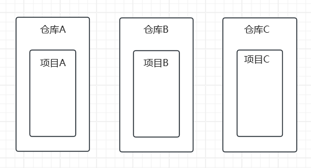
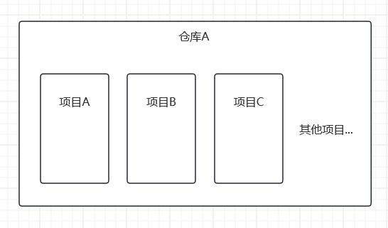

# {{ $frontmatter.title }}

在开发中，代码库的管理方式一般有两种：Multirepo 和 Monorepo

## Multirepo(多仓库)

Multirepo 指的是每个项目都有自己独立的版本控制系统，具体的表现就是一个项目对应一个 git 仓库

Multirepo 的管理方式通常用于独立性强，关联性弱的项目

例如：一个游戏项目和一个后台管理项目，两者都可以当作单个独立的项目开发，使用 Multirepo 的方式管理项目则比较合适

Multirepo 的特点：

1. 物理隔离：每个项目独立开发，耦合度低

2. 技术栈自由：每个仓库可以自由选择开发框架，构建工具，ESLint配置等

3. 依赖冗余：每个项目的依赖单独管理，多个项目的共同依赖会存在多份

## Monorepo(单仓库)

Monorepo 指的是在一个版本控制系统管理多个项目，具体的表现就是一个 git 仓库中存在多个项目代码

Monorepo 的管理方式通常用于关联性强的项目

例如：组件库项目和依赖了该组件库开发的多个业务项目，两者存在强关联性，使用 Monorepo 的方式统一管理项目则比较合适

Monorepo 的特点：

1. 统一管理：所有项目放在一个仓库中，统一配置构建工具，代码规范

2. 代码复用：多个项目之间可以轻松共享代码和工具，减少冗余代码

3. 一致的依赖管理：所有项目可以统一管理依赖版本，避免版本冲突

4. 原子提交：可以同时修改多个关联的项目，保证代码变更的原子性

我们可以使用 `pnpm workspace` 功能实现 Monorepo 方案
