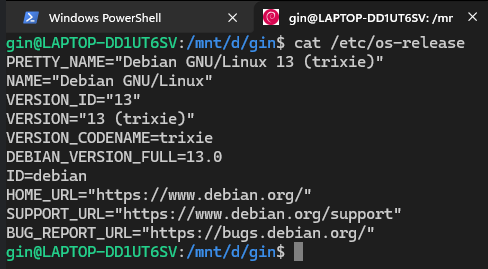
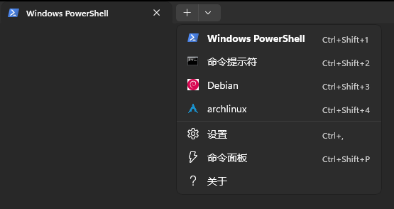
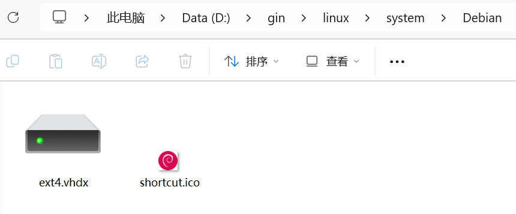
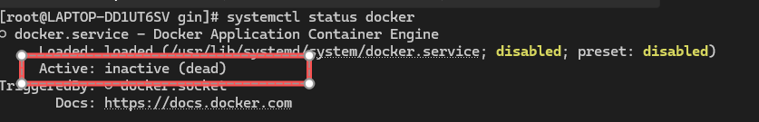
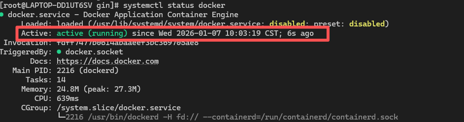
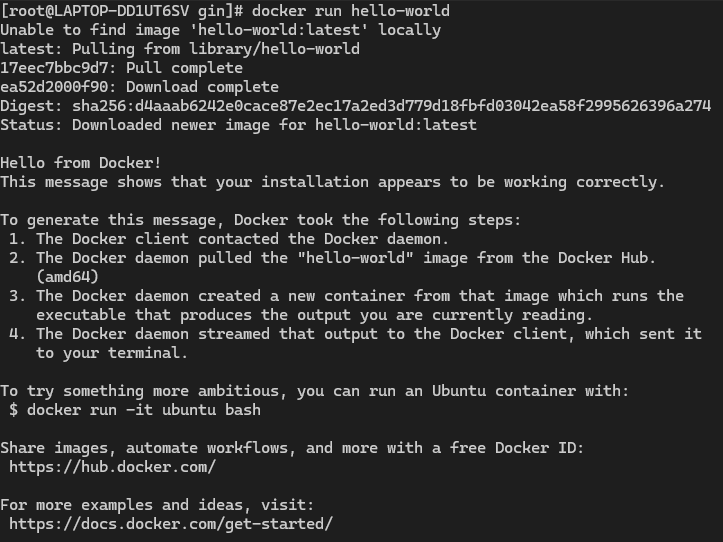
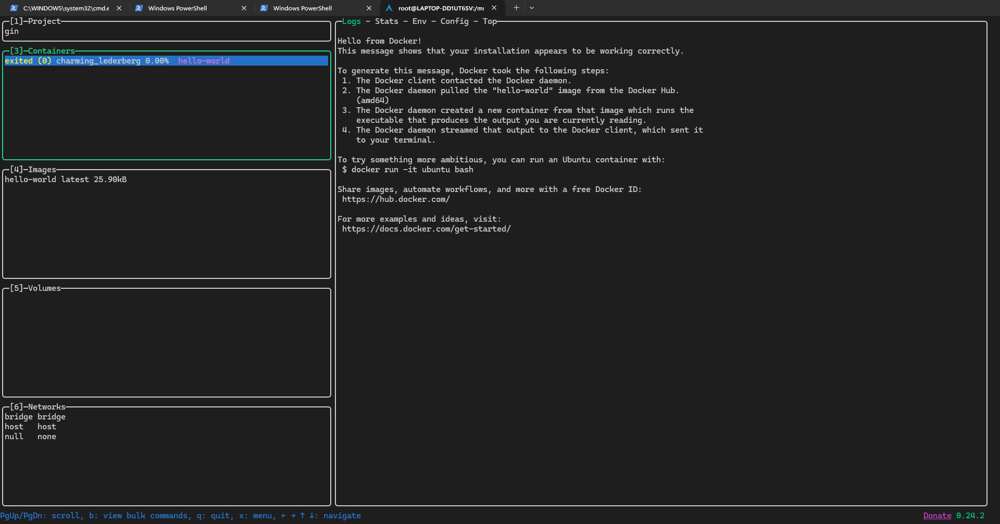

# WSL

微软文档: https://learn.microsoft.com/zh-cn/windows/wsl/

借助 WSL 我们可以在 Windows 上运行 Linux 环境, 微软官方也建议使用 WSL 作为 Windows 下 Docker 的后端服务

## WSL 的版本

微软官方推荐使用的是 WSL2, 并且默认使用的也是 WSL2, 使用下面的命令可以查看 WSL 的版本

```pwsh
wsl -v
```

在列出信息中, 我们可以看到 `WSL 版本`

```
WSL 版本: 2.6.3.0
内核版本: 6.6.87.2-1
WSLg 版本: 1.0.71
MSRDC 版本: 1.2.6353
Direct3D 版本: 1.611.1-81528511
DXCore 版本: 10.0.26100.1-240331-1435.ge-release`
```

如果 WSL 的版本不为 2, 也可以使用下面的命令将其设置为 `WSL2`

```pwsh
wsl --set-default-version 2
```

## Linux 发行版

Linux 本身只是一个操作系统内核, 它还不是一个完整的操作系统, 为了能让用户使用 Linux 还需要额外的工具和应用, 一般都是 `GUN 工具`, 一个完整的 Linux 操作系统会是 `Linux内核 + GUN 工具 + 软件包管理器 + (其他软件)`

因此, 我们应该更准确的将其称呼为 `GUN/Linux操作系统`, 以强调 `GUN 工具` 在操作系统中的重用性

Linux 发行版则是由各个机构或社区基于 `Linux 内核` 配合 `GUN 工具` 发行的一个完整的操作系统, 常见的发行版有: Debian, Ubuntu, Fedora, CentOS, ArchLinux等

<details>
  <summary><strong>GUN 计划</strong></summary>
  <p>简单讲一下 GUN 计划, 它应该被和 Linux 同时提起</p>
  <p>GUN 计划旨在创建一个与 Unix 兼容, 但又不受 Unix 名称和源代码私有限制的操作系统, 可以理解为实现一个开源的 Unix 系统</p>
  <p>GUN 项目实现了非常多开源的软件, 例如: gcc, bash, emacs等, 但一直没有实现自己的操作系统内核</p>
  <p>在 Linux 内核发布后, 填补了 GUN 项目没有操作系统内核的空白, 在社区的助力下, GUN/Linux 系统蓬勃发展</p>
</details>

## 列出 Linux 发行版

### 列出已安装的 Linux 发行版

下面的命令会列出已经安装的 Linux 发行版

```pwsh
wsl --list --verbose
```

如果存在已经安装的发行版, 命令的执行结果会如下：

```
  NAME         STATE           VERSION
* Debian       Running         2
  archlinux    Stopped         2
```

### 列出可用的 Linux 发行版

下面的命令会列出可安装的 Linux 发行版, 以方便我们选择对应的发行版进行安装

这一步可能遇到墙, 可以把代理或梯子打开, 包括安装的时候也可能遇到, 也建议在安装发行版的时候走代理

```pwsh
wsl --list --online
```

命令的执行结果如下, 在列出的结果中可以看到许多发行版

```
以下是可安装的有效分发的列表。
使用“wsl.exe --install <Distro>”安装。

NAME                            FRIENDLY NAME
Ubuntu                          Ubuntu
Ubuntu-24.04                    Ubuntu 24.04 LTS
openSUSE-Tumbleweed             openSUSE Tumbleweed
openSUSE-Leap-16.0              openSUSE Leap 16.0
SUSE-Linux-Enterprise-15-SP7    SUSE Linux Enterprise 15 SP7
SUSE-Linux-Enterprise-16.0      SUSE Linux Enterprise 16.0
kali-linux                      Kali Linux Rolling
Debian                          Debian GNU/Linux
AlmaLinux-8                     AlmaLinux OS 8
AlmaLinux-9                     AlmaLinux OS 9
AlmaLinux-Kitten-10             AlmaLinux OS Kitten 10
AlmaLinux-10                    AlmaLinux OS 10
archlinux                       Arch Linux
FedoraLinux-43                  Fedora Linux 43
FedoraLinux-42                  Fedora Linux 42
Ubuntu-20.04                    Ubuntu 20.04 LTS
Ubuntu-22.04                    Ubuntu 22.04 LTS
OracleLinux_7_9                 Oracle Linux 7.9
OracleLinux_8_10                Oracle Linux 8.10
OracleLinux_9_5                 Oracle Linux 9.5
openSUSE-Leap-15.6              openSUSE Leap 15.6
SUSE-Linux-Enterprise-15-SP6    SUSE Linux Enterprise 15 SP6
```

## 安装 Linux 发行版

在知道有哪些可用的 Linux 发行版后, 我们就可以安装需要的发行版了

**推荐几个发行版**

1. Debian -- 社区活跃, 很多问题可以在 [Wiki](https://wiki.debian.org/FrontPage) 中找到答案
 
2. Ubuntu -- 大部分刚接触 Linux 的都安装这个发行版, 遇到问题应该能很好的找到解决的办法

3. Arch Linux -- 因为这是我在用的发行版, 23333, [Arch Wiki](https://wiki.archlinux.org/title/Main_page) 也相当丰富

ps: 可以先安装 `archlinux`, 因为在下面安装 `docker` 的内容中, 使用的是 `archlinux` 作为演示; 原因是各个发行版的默认软件源访问都非常慢, 一般都需要更换为国内的镜像源, 在给其他发行版更换国内镜像源的时候, 都没有成功, 可能也是我不熟悉其他发行版, 所以我会使用 `archlinux` 来安装 `docker`

**安装目录的规划**

WSL 除了可以通过安装发行版获得 Linux 环境, 还支持导入与导出发行版, 所以我们可以规划一下保存 Linux 相关的目录

我们可以在D盘中一个习惯的工作目录下创建 linux 目录, 并在 linux 目录中创建 export 目录用于存放导出的发行版; system 目录用于存放发行版本身

例如: 我习惯将 `D:\gin` 作为做的工作目录, 并在该目录下创建了 `linux\export` 和 `linux\system` 目录,  目录结构大概如下

```tree
D:\gin\linux
├─export         // 用于存放导出的发行版文件
└─system         // 用于存放发行版本身, 即发行版的安装目录
    ├─ArchLinux  // archlinux 发行版
    └─Debian     // debian 发行版
```

使用下面的命令安装需要的发行版

```pwsh
# --distribution 参数用于指定安装的发行版
# --location 参数用于指定发行版的安装路径; 不指定安装路径的话会默认安装到 C盘中

wsl --install --distribution <发行版名称> --location <安装路径>
```

例如: 将 `Debian` 安装到 D:\linux\system\Debian 目录下

```pwsh
wsl --install --distribution Debian --location D:\linux\system\Debian
```

安装完成后, 终端就会进入 Linux 环境, 看到 shell 的命令行提示符改变了就说明我们已经在安装好的 Linux 发行版中了

在下面的图片中可以看到我们已经是在 `Debian` 系统中了



安装完成后, Windows 终端的下拉启动项中也会多出一个 `Debian` 的启动项, 我们之后也随时可以从这些启动项中进去 Linux 环境



我们可以看一下最终安装的产物是什么, 在我们指定的安装路径(`D:\linux\system\Debian`)中可以看到只有 `ext4.vhdx` 和 `shortcut.ico` 两个文件

* `ext4.vhdx` -- ext4 其实是 Linux 中的一个文件系统, 这里可以把它看成我们安装的发行版本身, 我们在 Linux 中的安装的所有软件都在这个 `ext4.vhdx` 文件中, 因此这并不会污染我们宿主机的环境

* `shortcut.ico` -- 发行版的图标



## 终止 Linux 发行版

使用下面的命令可以终止正在运行的 Linux 发行版

```pwsh
wsl --terminate <发行版名称>
```

例如: 终止 `Debian`

```pwsh
wsl --terminate Debian

# 再使用 wsl --list --verbose 命令查看发行版, 可以看到 Debian 的状态是 Stopped
```

## 关机

使用下面的命令会将所有的 Linux 发行版都停止运行

```pwsh
wsl --shutdown

# 再使用 wsl --list --verbose 命令查看发行版, 可以看到所有的发行版的状态都是 Stopped
```

## 卸载 Linux 发行版

使用下面的命令可以卸载对应的发行版

```pwsh
wsl --unregister <发行版名称>
```

例如: 卸载 `Debian`

```pwsh
wsl --unregister Debian
```

卸载成功后, 可以看到已经不存在 `D:\linex\system\Debian` 这个目录了, 说明卸载成功后对应的发行版会被删除

## 导出 Linux 发行版

在我们是使用了一段时间 linux 后, 里面可能已经有许多我们安装好的环境或文件, 我们可以将这个 Linux 导出成一个 `.tar` 文件, 方便我们在新的电脑上导入或者分享给他人

使用下面的命令可以导出一个发行版

```pwsh
wsl --export <发行版名称> <目标文件路径>
```

例如: 将 `Debian` 导出到 `D:\linux\export\Debian.tar` 下

```pwsh
wsl --export Debian D:\linux\export\Debian.tar
```

导出成功后可以看到 `D:\linux\export` 目录下存在 `Debian.tar` 文件

如果有需要的话, 我们就可以把这个导出的 `Debian.tar` 文件分享给他人, 或者在新的电脑上需要使用 Linux 环境的时候, 直接导入这个文件

## 导入 Linux 发行版

在获得 `.tar` 的导出文件后， 可以使用下面的命令导入该文件

```pwsh
wsl --import <发行版名称> <发行版安装路径(必须是空目录)> <导出的tar文件路径>
```

例如: 导入 `Debian.tar` 文件

```pwsh
wsl --import Debian D:\linux\system\Debian D:\linux\export\Debian.tar
```

导入成功后可以看到 `D:\linux\system` 目录下存在 `Debian` 目录, 里面就是 Debian 发行版的 `ext4.vhdx` 和 `shortcut.ico` 文件了

## 安装 Docker

在我们拥有了 Linux 环境后, 其实可以直接将 Docker 安装在 Linux 中, 这样既不会污染宿主机的环境, 并且由于 Linux 是安装在D盘的, 将 Docker 安装在 Linux 中自然也是在D盘的

这里使用的是 `archlinux` 发行版作为演示, `archlinux` 的软件包管理器是 `pacman`, 我们可以用 `pacman` 命令来安装软件

在安装软件之前, 我们需要把默认的软件源更换为国内的镜像源地址, 一般推荐的是: [清华大学开源软件镜像站](https://mirrors.tuna.tsinghua.edu.cn/help/archlinux/)

我们需要在 `/etc/pacman.d/mirrorlist` 文件中修改 `archlinux` 的软件源, 我们可以使用下面的命令来修改 `/etc/pacman.d/mirrorlist` 文件

```sh
# 1. 先备份原来的软件源文件
cp /etc/pacman.d/mirrorlist /etc/pacman.d/mirrorlist.bak

# 2. 因为 archlinux 不自带默认编辑器, 我们需要使用 echo 命令将新的软件源替换旧的软件源
echo "Server = https://mirrors.tuna.tsinghua.edu.cn/archlinux/\$repo/os/\$arch" > /etc/pacman.d/mirrorlist

# 3. 使用 cat 命令查看 /etc/pacman.d/mirrorlist 文件是否修改成功, 如果打印的是上面清华的地址说明修改成功
cat /etc/pacman.d/mirrorlist

# 4. 最后更新软件源, 等待更新结束就可以了
pacman -Syyu
```

---

在更新好软件源后, 我们就可以安装各种软件了, 使用下面的命令安装 `docker`

```sh
# 1. 安装 docker, 等待安装完成
pacman -S docker

# 2. 验证是否安装成功, 如果下面的命令成功打印 docker 的版本, 说明安装成功
docker --version
```

---

由于 `docker` 的镜像源在国外, 国内几乎不可访问, 我们也需要为 `docker` 更换国内的镜像源

`docker` 的镜像源文件在 `/etc/docker/daemon.json`, 如果这个文件不存在就需要手动创建

```sh
# 1. 创建 /etc/docker 目录
mkdir -p /etc/docker

# 2. 创建 /etc/docker/daemon.json 文件
touch /etc/docker/daemon.json

# 3. 将镜像源写入 /etc/docker/daemon.json 文件中
tee /etc/docker/daemon.json <<EOF
{
  "registry-mirrors": [
    "https://docker.m.daocloud.io",
    "https://docker.imgdb.de",
    "https://docker-0.unsee.tech",
    "https://docker.hlmirror.com",
    "https://docker.1ms.run",
    "https://func.ink",
    "https://lispy.org",
    "https://docker.xiaogenban1993.com"
  ]
}
EOF

# 4. 重新加载 /etc/docker/daemon.json 文件
systemctl daemon-reload
```

---

在添加镜像源之后还需要启动 `docker` 服务

**查看 docker 服务的状态**

使用下面的命令查看 `docker` 服务的状态, `Active` 为 `inactive` 是服务未启动, `active` 则是服务已启动

```sh
systemctl status docker
```



---



**启动 docker 服务**

```sh
systemctl start docker
```

**停止 docker 服务**

```sh
systemctl stop docker.socket
```

**重启 docker 服务**

```sh
systemctl restart docker
```

**自启动 docker 服务**

```sh
systemctl enable docker
```


**取消自启动 docker 服务**

```sh
systemctl disable docker
```

---

在启动 `docker` 服务之后, 我们就可以使用 `docker` 了

使用 `hello-world 镜像` 测试 `docker` 是否可以正常使用

```sh
docker run hello-world
```

在看到`hello-world 容器`启动的画面后说明 `docker` 就可以正常使用了



---

其实 `docker` 的学习有点类似 `git`, 我们都需要了解一些基本的概念和命令, 在熟悉其中的概念和使用相应的命令后, 我们再考虑使用一些 ui 程序提升效率, 例如: `git` 的 `lazygit`, `docker` 的 `docker desktop`

举一反三, `git` 有 `lazygit` 的话, 那么 `docker` 自然也是有 `lazydocker` 的啦


